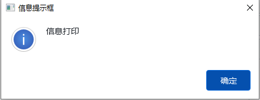
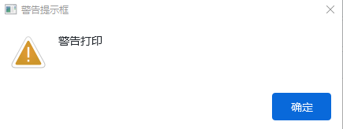
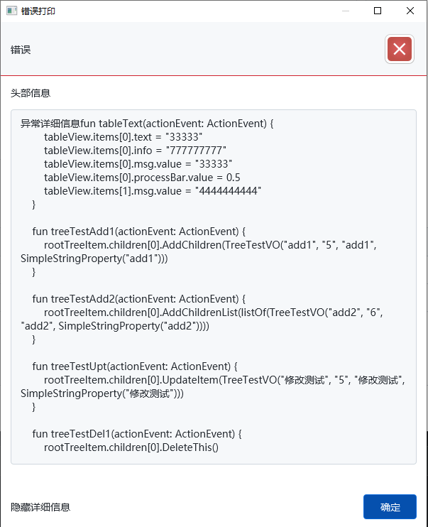
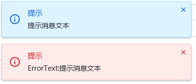
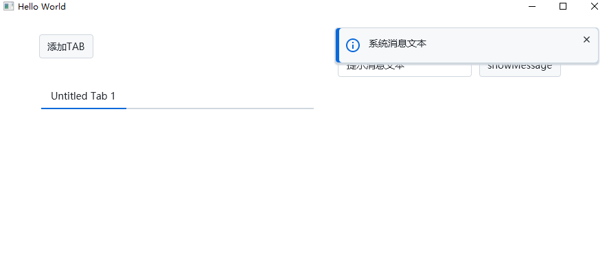
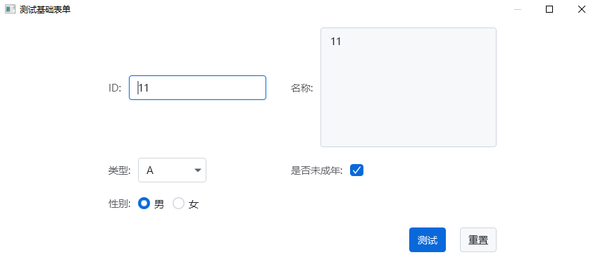
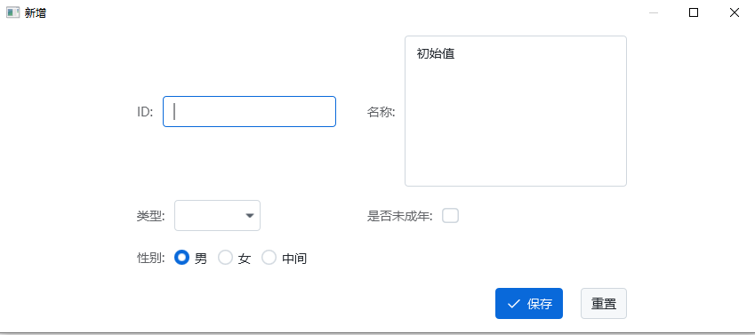
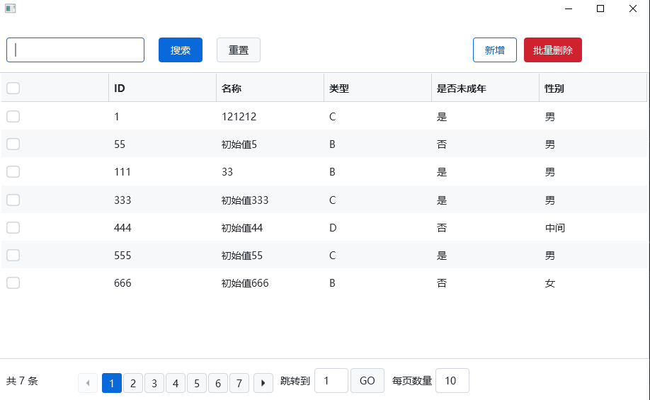

## LerverUI简介

LerverUI是一个基于javaFX框架封装了部分UI组件、常用操作的框架,语言采用 [Kotlin](https://book.kotlincn.net/text/getting-started.html)。

---

部分功能(模态窗口提示、弹出通知、样式)引用和借鉴了[easyfx](https://github.com/xizi110/easyfx)。

JavaFX的样式UI组件引用了[atlantafx](https://github.com/mkpaz/atlantafx)。

---

## 使用方式

### 通过Maven引入

```
<dependency>
    <groupId>cn.lifay.LerverUI</groupId>
    <artifactId>Core</artifactId>
    <version>1.54</version>
</dependency>

<repositories>
    <repository>
        <id>lifay-public</id>
        <url>http://www.lifay.cn:8081/repository/maven-public/</url>
    </repository>
</repositories>
```

### 下载源码编译

```
1.需要jdk17和kotlin环境
2.Parent模块clean install
```

## 快速入门

1.DemoApplication继承BaseApplication

```
//默认启动（不带db组件-sqlite数据库）
class DemoApplication : BaseApplication() {
override fun start(primaryStage: Stage?) {
        AppManage.loadAppConfig()
        val fxmlLoader = FXMLLoader(DemoApplication::class.java.getResource("formTest.fxml"))
        val load = fxmlLoader.load<Parent>()
        val scene = Scene(load)
        primaryStage!!.title = "Hello World111"
        primaryStage.scene = scene
        primaryStage.setOnCloseRequest {
            println("GlobeStartUp.launch close window...")
        }
        primaryStage.show()
    }
}
//以db组件的方式启动（函数体内为程序初始界面）
class DemoApplication : InitDbApplication() {

    override fun addAppStage(): Stage {
        val pane = VBox(42.0)
        pane.children.add(Button("dasdsadasd"))

        val stage = Stage()
        stage.title = "首页"
        stage.centerOnScreen()
        stage.setOnCloseRequest {
            println("CommonDbDemo close window...")
        }
        stage.scene = Scene(pane)
        return stage
    }
}
```

2.启动

```
fun main() {
    Application.launch(DemoApplication::class.java)
}

```

3.新建一个CommonDemoView(控制器视图)继承BaseView

```
class CommonDemoView : BaseView<AnchorPane>() {
    
    @FXML
    var rootPane = AnchorPane()

    override fun rootPane(): AnchorPane {
        return rootPane
    }

}
```

4.创建控制器视图实例示例代码

```
    val view = BaseView.createView<CommonDemoView, AnchorPane>(XXXApplication::class.java.getResource("demo.fxml"))
    val scene = Scene(view.ROOT_PANE)
    primaryStage.title = "Hello World"
    primaryStage.scene = scene
    primaryStage.show()
```

## 常用操作

1.初始化样式主题

```

//通过启动类继承BaseApplication指定theme
abstract class BaseApplication(
    theme: Theme = PrimerLight(),
    logPrefix: String = "client",
    logPath: String = System.getProperty("user.dir") + File.separator + "logs"
)

//通过GlobalResource实时设置样式主题
GlobalResource.loadTheme(PrimerDark())
```

2.为窗体指定图标（图标默认路径：/icon.png，即将icon.png放在resources目录下，会自动引入）

```
//为stage指定图标（如果是通过框架创建的stage，一般已经默认设置了）
GlobalResource.loadIcon(stage)

//自定义图标路径
GlobalResource.setGlobalIconImage(imgPath)
```

3.主线程执行(Platform.runLater)

```
platformRun{
    tudo()
}

```

4.校验参数

```
if(!checkParam("名称",name)){
    return
}
```

5.异步协程执行

```
asyncTask {
    //后台执行
}
```

6.异步延迟执行耗时操作 时间：毫秒

```
asyncDelayTask(500) {
    platformRun { closeFunc() }
}
```

7.异步执行耗时操作,同时有加载图标提示

```
asyncTaskLoading(getWindow(), "保存中") {
    try {
        //后台操作
    } catch (e: Exception) {
        e.printStackTrace()
        showErrMessage("保存失败:" + e.message)
    } finally {
        //结束操作
    }
}
```

8.为Stage绑定快捷键:ESC关闭窗口

```
stage.bindEscKey()
```

9.常用弹出提示





```
alertInfo("信息打印")
alertWarn("警告打印")
alertError(
    "错误打印","头部信息", "异常详细信息fun tableText(actionEvent: ActionEvent) {\n" +
            "        tableView.items[0].text = \"33333\"\n" +
    
            "    }\n"
)
```

10.快速复制文本到粘贴板

```
copyToClipboard("文字")
```

## 视图容器

> 视图=Controller，BaseView 内置封装了便捷功能




1.视图类定义（1）

```kotlin
//简单使用：定义测试View 继承BaseView 传入fxml资源
class BaseViewDemoView1 : BaseView<AnchorPane>(BaseViewDemoView1::class.java.getResource("baseView.fxml")) {

    @FXML
    private val rootPane = AnchorPane()

    /**
     * 注册根容器
     */
    override fun rootPane(): AnchorPane {
        return rootPane
    }
}

//初始化
val baseView = BaseViewDemoView1()
primaryStage.title = "Hello World"
primaryStage.scene = Scene(baseView.ROOT_PANE)
primaryStage.show()
```

2.视图类定义（2）

```kotlin

//定义测试View 继承BaseView
class BaseViewDemoView2 : BaseView<AnchorPane>() {
    //定义最顶级pane,注意rootPane不能为val
    @FXML
    var rootPane = AnchorPane()

    //返回rootPane
    override fun rootPane(): AnchorPane {
        return this.rootPane
    }

    //可选
    override fun initialize(p0: URL?, p1: ResourceBundle?) {
        super.initialize(p0, p1)
    }
    //封装功能:
    showNotification("右上角系统通知")
    showMessage("应用提示")
}

//(1)外部实例化
val view = BaseView.createView<BaseViewDemoView2, AnchorPane>(BaseViewDemo::class.java.getResource("baseViewDemo.fxml"))
val scene = Scene(view.getRoot())
primaryStage.title = "Hello World"
primaryStage.scene = scene
primaryStage.show()

//(2)BaseView内部实例化
val view = createView<BaseViewDemoView2, AnchorPane>(BaseViewDemo::class.java.getResource("baseViewDemo.fxml"))
val scene = Scene(view.getRoot())
primaryStage.title = "Hello World"
primaryStage.scene = scene
primaryStage.show()

//(3)直接创建Stage窗口
val stage = createViewStage<BaseViewDemoView2, AnchorPane>(
    "窗口标题",
    BaseViewDemo::class.java.getResource("baseViewDemo.fxml"),
    closeFunc = {},
    initFunc = {})
stage.show()
```

---

## 消息总线

> 消息总线一般是为了解决跨界面无耦合回调执行操作，并且可以多界面同时触发

```
使用方法：

1.为事件定义枚举类ID，实现EventBusId

enum class DemoId : EventBusId {
    RELOAD_UI,
    CHAT,
}

2.订阅注册：将来会被触发执行的匿名函数

//DefaultEvent为内置无参事件传输DTO
EventBus.subscribe(DemoId.RELOAD_UI, DefaultEvent::class) {
    platformRun {
        tableView.refresh()
    }
}
//TextEvent为内置事件传输DTO，包含一个String类型参数
EventBus.subscribe(DemoId.CHAT, TextEvent::class) {
    platformRun {
        user1.appendText("${it.text}\n")
    }
}
//其他的BodyEvent是传递实体参数

3.发布消息

EventBus.publish(DefaultEvent(DemoId.RELOAD_UI))

EventBus.publish(TextEvent(DemoId.CHAT, sendText.text))
```

## 表单视图

> 自动绑定实体类、组合表单元素和基础操作功能

1.定义普通表单 BaseFormUI（这里选择直接实例化,也可创建一个类继承和实现BaseFormUI）


```kotlin
val baseFormUI = BaseFormUI<UserData>("测试基础表单") {
    //设置默认填充内容
    defaultEntity(UserData(11, "11", SelectTypeEnum.A, true, "男"))

    //定义和添加元素
    val nameElement =
        TextElement("名称:", UserData::name, isTextArea = true, primary = false, initValue = "初始值") {
            isDisable = false
            isEditable = true
        }
    addElements(
        TextElement("ID:", UserData::id, true),
        nameElement,
        SelectElement("类型:", UserData::type, SelectTypeEnum.values().toList()),
        CheckElement("是否未成年:", UserData::child),
        RadioElement("性别:", UserData::sex, listOf("男", "女")) {
            //ui操作
        }
    )

    //添加按钮和操作
    addCustomButtons(
        BaseButton(Button("测试").styleInfo()) {
            showNotification("测试获取name内容:${nameElement.getElementValue()}")
        },
        clearBtn()
    )

    //表单初始化前操作
    beforeFormInitCall {
        showNotification("还没初始化")
    }

    //表单初始化后操作
    afterFormInitCall {
        showNotification("已经初始化完毕")
    }

    //窗口关闭操作
    setOnCloseRequest {
        println("窗口已关闭")
    }
}
//展示窗口
baseFormUI.show()
```

2.定义数据表单 DataFormUI（这里选择创建一个类继承和实现DataFormUI,也可直接实例化并实现）


```kotlin
//注意变量需要可修改,定义为var
data class UserData(
    var id: Int,
    var name: String,
    var type: SelectTypeEnum?,
    var child: Boolean,
    var sex: String,
)

class UserDataForm(t: UserData? = null, isUpdate: Boolean = false) :
    DataFormUI<UserData>(_isUpdate = isUpdate, buildFormUI = {
        if (t != null) {
            defaultEntity(t)
        }
        val id = TextElement("ID:", UserData::id, true)
        id.fillValue = 666

        val name = TextElement("名称:", UserData::name, isTextArea = true, primary = false, initValue = "初始值")
        val type = SelectElement("类型:", UserData::type, SelectTypeEnum.values().toList())
        val child = CheckElement("是否未成年:", UserData::child)
        val sex = RadioElement("性别:", UserData::sex, listOf("男", "女", "中间"))
        addElements(id, name, type, child, sex)

        addCustomButtons(BaseButton(Button("测试自定义按钮").styleWarn()) {
            println(it)
        })
    }) {

    //保存操作
    override fun saveDataFunc(entity: UserData): Boolean {
        if (entity!!.name!!.isBlank()) {
            throw LerverUIException("名称不能为空!")
        }
        UserDatas.add(entity)
        return true
    }

    //更新操作
    override fun updateDataFunc(entity: UserData): Boolean {
        UserDatas.update(entity)
        return true
    }
}
```

3.定义CURD增删查改界面 CurdUI（这里选择创建一个类继承和实现CurdUI,也可直接实例化并实现）

```kotlin
class UserManage : CurdUI<UserData>("用户管理", buildElements = {

    val id = TextElement("ID:", UserData::id, true)
    val name = TextElement("名称:", UserData::name, isTextArea = true, primary = false, initValue = "初始值")
    val type = SelectElement("类型:", UserData::type, SelectTypeEnum.values().toList())
    val child = CheckElement("是否未成年:", UserData::child)
    val sex = RadioElement("性别:", UserData::sex, listOf("男", "女", "中间"))
    addElements(id, name, type, child, sex)

    addCustomButtons(BaseButton<DataFormUI<UserData>>(Button("测试自定义按钮").styleWarn()) {
        println(it)
    })
}) {

    //分页实现,返回：1-数据总数量 2-根据页码和每页数量的查询逻辑
    override fun pageDataFunc(pageIndex: Int, pageCount: Int): Pair<Int, Collection<UserData>> {
        return Pair(
            DbManage.userDatas.totalRecordsInAllPages, DbManage.userDatas.drop(pageIndex * pageCount)
                .take(pageCount).toList()
        )
    }

    //更新操作
    override fun updateDataFunc(entity: UserData): Boolean {
        return true
    }

    //保存操作
    override fun saveDataFunc(entity: UserData): Boolean {
        if (entity!!.name!!.isBlank()) {
            throw LerverUIException("名称不能为空!")
        }
        return true
    }

    //删除操作
    override fun delDataFunc(entity: UserData): Boolean {
        return true
    }

}
```

## 树视图

> 考虑到树有很多应用场景，业务过程中产生很多冗余代码

- 根据数据集自动构建树节点，也可一键动态刷新
- 动态添加
- 动态删除
- 动态修改

注册和定义数据源

```kotlin
//（分List数据、Tree数据两种数据源）
//Register-为treeView实例注册，示例中数据源为List模式，所以需要传入id和parentId的属性引用，函数体内是获取数据源的逻辑代码
treeView.apply {
    root = rootTreeItem
    isShowRoot = true
    Register(TreeTestVO::id, TreeTestVO::parentId, true) {
        listOf(test1, test2, test3)
    }
}

//刷新树节点，并可选择添加过滤逻辑
treeView.RefreshTree<TreeTestVO, String>(filterFunc = {
    it.name.contains(s2)
})

//根据实体类的id查找所在TreeItem实例，并更新实体
val treeItem = treeView.GetItemByBusiId("add1")
treeItem?.UpdateItem(TreeTestVO("修改测试222", "5", "修改测试222", SimpleStringProperty("修改测试22")))

//为treeItem添加子元素
val selectedItem = treeView.selectionModel.selectedItem
selectedItem.AddChildren(
    TreeTestVO(
        "根节点下节点1",
        "6",
        "根节点下节点1",
        SimpleStringProperty("根节点下节点1")
    )
)
selectedItem.AddChildrenList(
    listOf(
        TreeTestVO(
            "根节点下节点2",
            "6",
            "根节点下节点2",
            SimpleStringProperty("根节点下节点2")
        )
    )
)

//删除当前TreeItem节点
rootTreeItem.children[0].DeleteThis()

//删除当前TreeItem的子节点
rootTreeItem.DeleteChildItem { it.id == "4" }

```

CheckBox树视图定义,cellFactory = CheckBoxTreeCell.forTreeView(),Register指定checkBox=true

```
    @FXML
    var treeTree = TreeView<TreeNodeDTO>()

    override fun initialize(p0: URL?, p1: ResourceBundle?) {

        val rootTreeItem = CheckBoxTreeItem(
            TreeNodeDTO("0", "-1", "根节点", "ss", ArrayList<TreeNodeDTO>(), GloabaUtil.TYPE_ROOT, 0)
        )
        treeTree.apply {
            root = rootTreeItem
            Styles.toggleStyleClass(this, Styles.DENSE)
            cellFactory = CheckBoxTreeCell.forTreeView()
            Register(TreeNodeDTO::id, TreeNodeDTO::children, true, true) {
                val treeNodeDTOs = tudo()
                treeNodeDTOs ?: emptyList()
            }
        }
        

    }

```